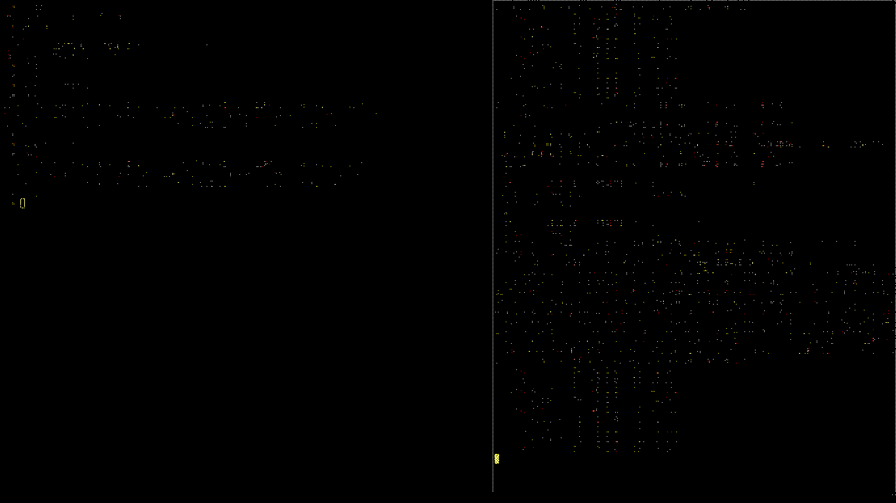

# What is this repo?

This is a game created by Mark Weston. I noticed when attempting a
```git pull```
that the [GitHub repository](https://github.com/Mark-Weston/sss) where
it was hosted was gone. It appears that at some point Mark deleted his GitHub
account, making this and his other projects unavailable.

To be honest, I can't remember ever playing the game. I haven't even read over
the code before making this repo. I just hope that by making this available,
anyone who wants it can see it. Don't expect me to maintain it or know anything
about it. Everything in this repo except this section of the README.md was
created by Mark or other prior contributors.

# Sassy Square Sally

Sassy Square Sally is a free and open-source 2D platformer.

It celebrates minimalism, symmetry, ornaments and rectangles.

The game caters to children, beginners and casual players.

It aims to provide a fun, easy and relaxing experience rather than a difficult but rewarding challenge.

In a complete coincidence, my two little sisters fit all three categories.

# Story

In the beginning we are introduced to a lovely tiny red square named Sally.

She engages into an exciting journey full of adventures and discoveries.

Her goal is to collect all the coins in all the little worlds she explores.

If she is feeling ambitious, she might challenge herself to do that as quickly as she can.

Deeper into the game the focus drifts from Sally to her many friends, different in size and shape.

Together, through the power of friendship and teamwork, they show how many can solve challenging puzzles that Sally alone could not.

# Gallery



# Controls

Jump:
* Arrow key up
* W
* H (vi style)
* Space
* Numpad 2
* Numpad 5

Go left:
* Arrow key left
* A
* J (vi style)
* Numpad 4

Go right:
* Arrow key right
* D
* K (vi style)
* Numpad 6

Restart
* R

Switch to next hero
* Tab

Quit:
* Q
* Escape

# Dependencies

* libc
* GLFW
* OpenGL ES 2.0
* OpenAL
* libvorbisfile

# Building

On a fresh Ubuntu install, in the directory you extracted the game:

    sudo apt-get install build-essential libglfw3-dev libgles2-mesa-dev libopenal-dev libvorbis-dev
    make
